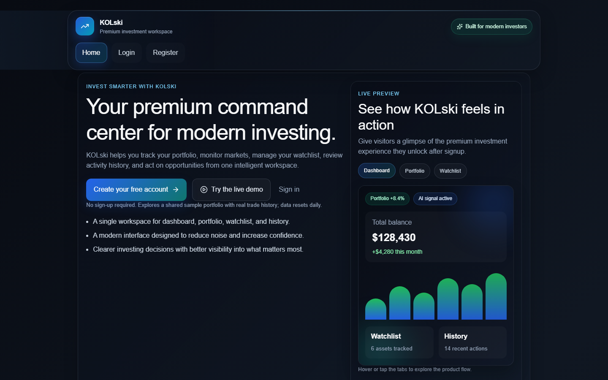
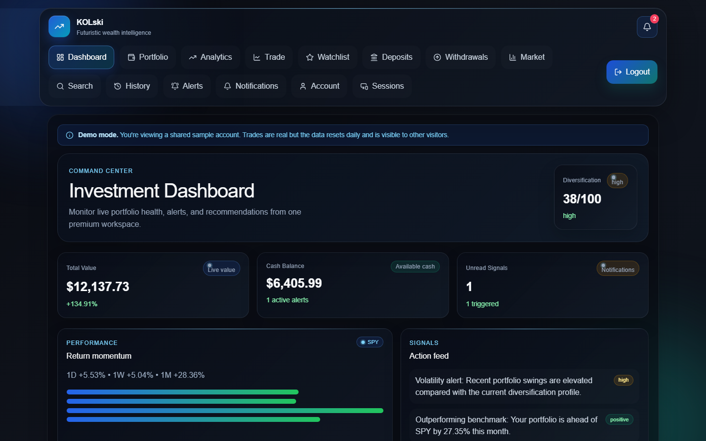
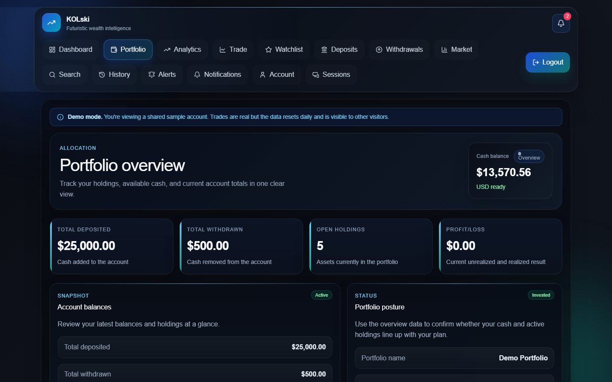
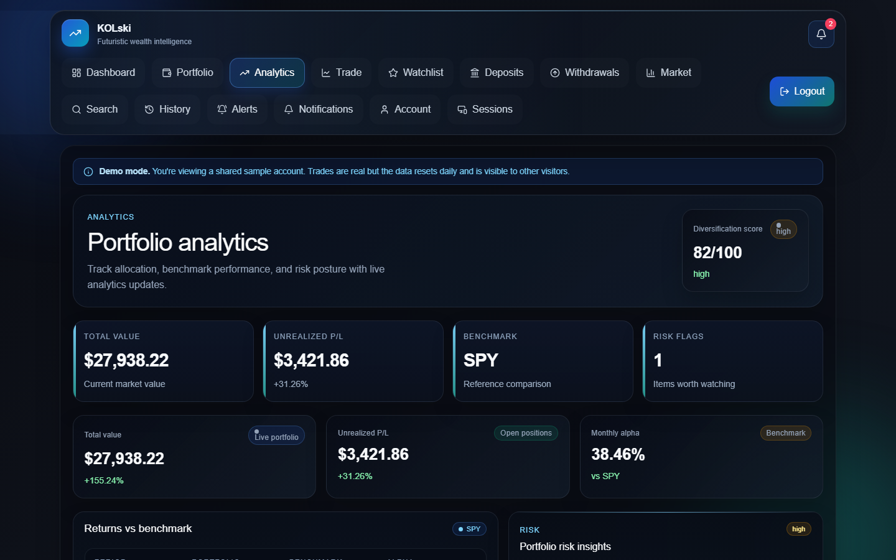
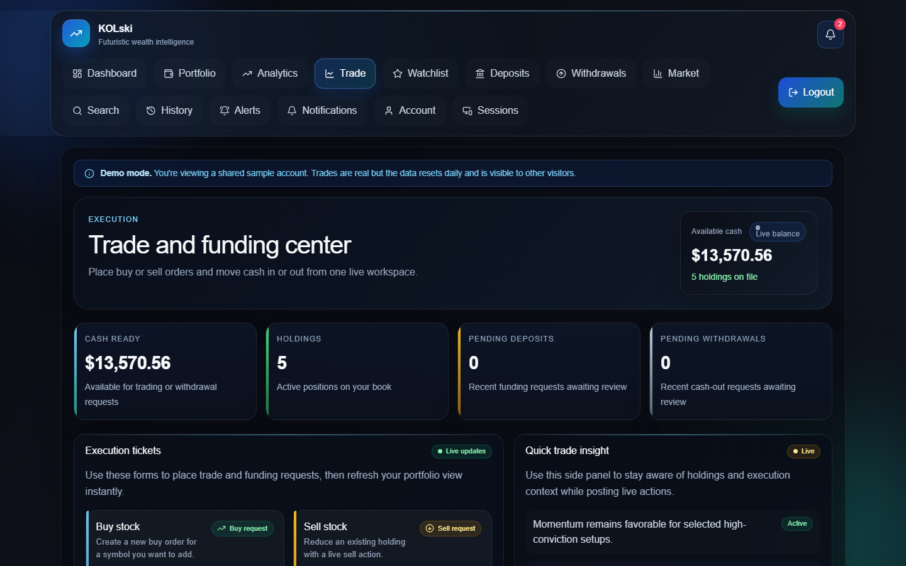
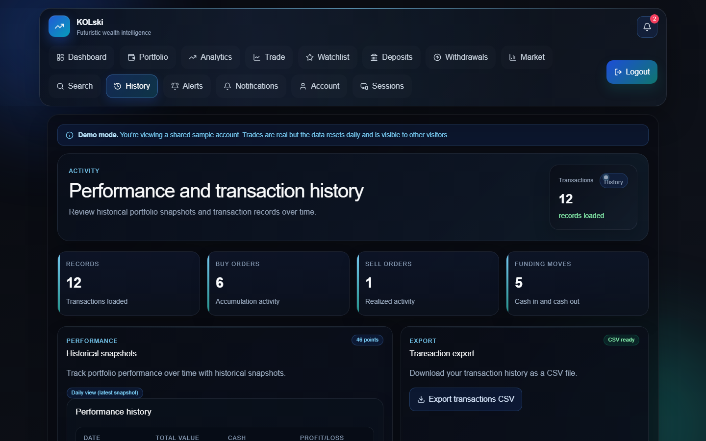
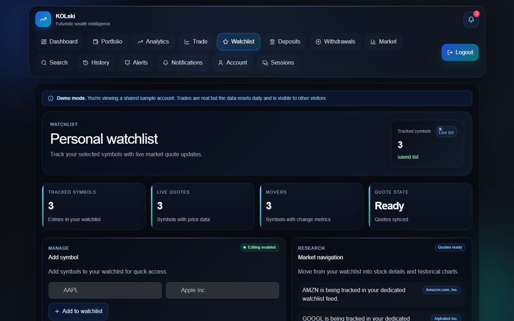
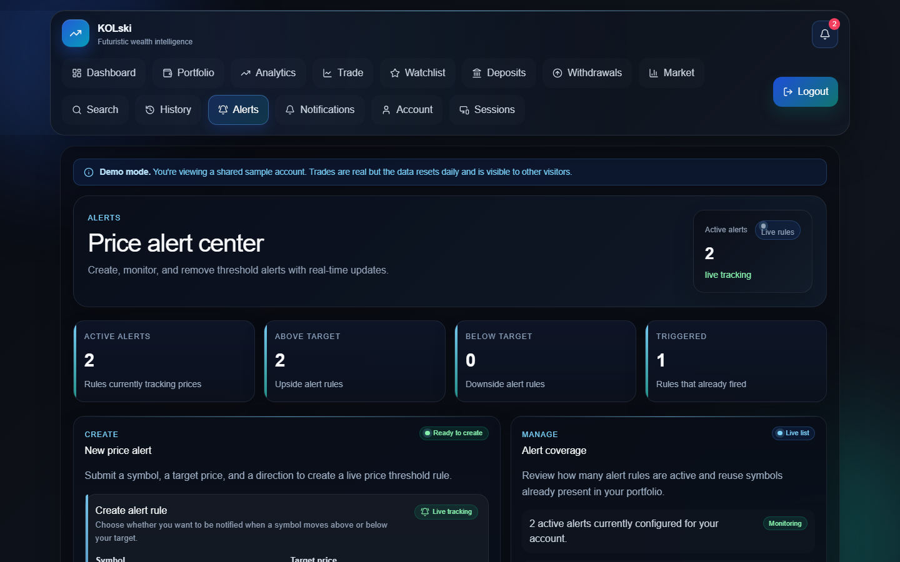
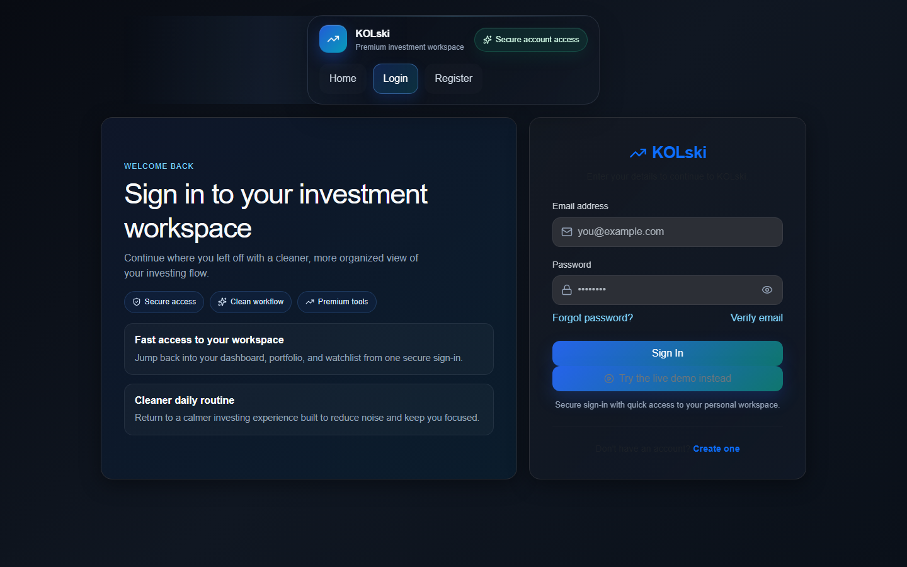

# KOLski

A full-stack simulated investing workspace: portfolio tracking, live market data,
server-priced trades, price alerts, and admin-reviewed deposits/withdrawals — built as
a real (fake-money) application, not a UI mockup.

[**Live demo →**](https://kolskinv.vercel.app) — click **Try the live demo** on the
landing page. No sign-up: it logs you straight into a shared sample portfolio (data
resets nightly). See the [backend repo](https://github.com/Ibreex187/KOLski-investmentBackend)
for the API this talks to.

[](https://github.com/Ibreex187/KOLski-investmentapp/actions/workflows/ci.yml)
[](https://github.com/Ibreex187/KOLski-investmentBackend/actions/workflows/ci.yml)
[](LICENSE)



## What this is

KOLski simulates a modern brokerage: users register, fund an account through an
admin-reviewed manual deposit flow, buy and sell stocks at live market prices, track
performance over time, and get notified when a price alert fires. It's a portfolio
project, so the parts that are usually skipped in a demo app — concurrency safety,
idempotent trades, graceful degradation when a third-party API is down, scheduled jobs
on serverless — are the parts I spent the most time on. See the
[backend README](https://github.com/Ibreex187/KOLski-investmentBackend#readme) for the
specifics and the tests that prove them.

## Screenshots

<details>
<summary>Dashboard, portfolio, analytics, trading, and more</summary>

| | |
|---|---|
| **Dashboard**  | **Portfolio**  |
| **Analytics**  | **Trade & fund**  |
| **History & export**  | **Watchlist**  |
| **Price alerts**  | **Sign in**  |

</details>

## Features

- **Auth** — register/login with email verification, refresh-token sessions, a
  sessions list you can revoke individual devices from, and forgot-password via OTP.
- **Portfolio** — buy/sell at the price the *server* fetches (never a client-supplied
  price), holdings with weighted-average cost, realized/unrealized P&L.
- **Funding** — deposits and withdrawals go through an admin-reviewed request queue,
  not instant self-service transfers.
- **Analytics** — allocation breakdown, a performance-over-time chart, a benchmark
  (SPY) comparison, and risk flags.
- **Market data** — live quotes and history; when the provider is unavailable the app
  says so rather than inventing a price.
- **Price alerts** — set an above/below threshold per symbol; a scheduled job checks
  active alerts and notifies you (in-app + email) when one fires.
- **Watchlist, transaction history + CSV export, in-app notifications.**
- **Admin console** — user/deposit/withdrawal management, security status, a live
  OpenAPI doc viewer.
- **Try-it demo mode** — one click, no registration, into a realistic seeded account.

## Tech stack

**Client** (this repo): React 19, Vite, Redux Toolkit, React Router, React Hook Form +
Zod, Recharts, Bootstrap/React-Bootstrap, Axios.

**[Backend](https://github.com/Ibreex187/KOLski-investmentBackend):** Node.js, Express,
MongoDB/Mongoose, JWT auth, Jest + Supertest + an in-memory MongoDB for integration
tests, deployed serverless on Vercel with scheduled jobs via GitHub Actions/Vercel Cron.

## Run it locally

Requires Node 20 and a running instance of the [backend](https://github.com/Ibreex187/KOLski-investmentBackend)
(see that repo's README — it can run in a degraded mode without MongoDB for basic UI work).

```bash
npm install
npm run dev       # starts Vite on http://localhost:5173
```

By default the client calls `http://localhost:4080/api/v1` when running on localhost.
Override with a `.env` file if your backend runs elsewhere:

```
VITE_API_BASE_URL=http://localhost:4080/api/v1
```

Other scripts:

- `npm run build` — production build to `dist/`.
- `npm run lint` — ESLint.
- `npm run preview` — serve the production build locally.

## Deployment

This app deploys to two targets from `main`:

- **Vercel** (`vercel.json`) — the canonical deployment, served from the domain root.
- **GitHub Pages** (`.github/workflows/deploy-pages.yml`) — served from a
  `/KOLski-investmentapp/` subpath; the build sets `GITHUB_PAGES=true` so Vite emits
  asset URLs with that prefix (`vite.config.js`). Building without that flag (the
  default, what Vercel uses) emits root-relative URLs instead.

## License

[MIT](LICENSE)
